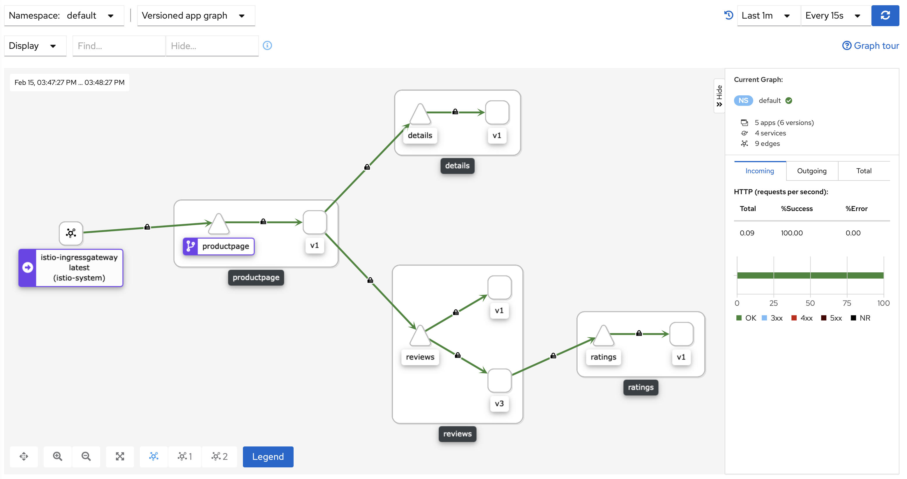

# View the dashboard

Istio integrates with several different telemetry applications. These can help you gain an understanding of the structure of your service mesh, display the topology of the mesh, and analyze the health of your mesh.

Install Prometheus addon. 

- `kubectl apply -f samples/addons/prometheus.yaml`{{execute}}

Install the latest version of Kiali Server using a Helm Chart. 

- `helm install --namespace istio-system --set auth.strategy="anonymous" --repo https://kiali.org/helm-charts kiali-server kiali-server`{{execute}}

Execute the following command to make sure the deployment was successful.

- `kubectl rollout status deployment kiali -n istio-system`{{execute}}

Access the Kiali dashboard by initializing in the terminal and then accessing the UI using the url below.

- `istioctl dashboard kiali --address=0.0.0.0 --browser=false`{{execute}}

https://[[HOST_SUBDOMAIN]]-20001-[[KATACODA_HOST]].environments.katacoda.com

**Note**: Generate some traffic by refreshing the `productpage` and see it in the dashboard how it reflects.

In the left navigation menu, select Graph and in the Namespace drop down, select default.
The Kiali dashboard shows an overview of your mesh with the relationships between the services in the Bookinfo sample application. It also provides filters to visualize the traffic flow.

